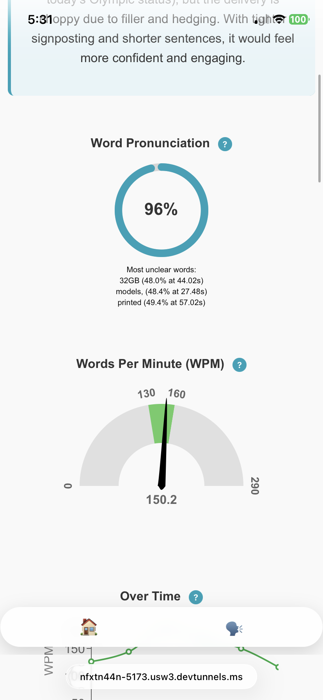
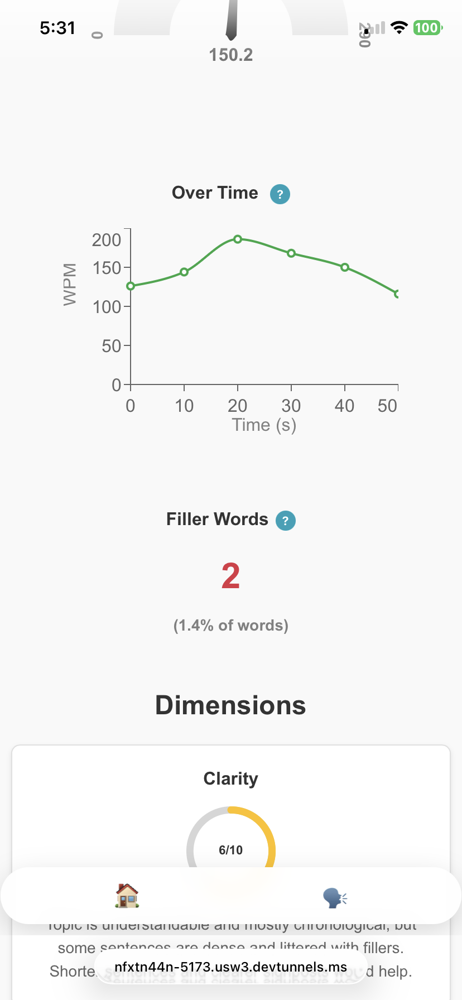

# Speach Improver App
This repository contains the full code for a speech improver app that gives etailed feedback on pronunciation, pacing, filler words, and the overall delivery of any speech, presentation, or conversation. It can be used from your phone/device, or paired with a hardware recorder.

This project was originally built as part of a six month team effort that combined hardware (a physical recording device) and software, presented at a project showcase. This repository covers the software side, which works on its own, where your device's microphone can replace the hardware recorder.

## Features
### Speech metrics
- Words per minute (WPM), WPM tracked over time 
- Filler word count and rate
- Pronunciation accuracy %, most unclear words





### Feedback
- Six category rubric scoring: clarity, filler words & habits, confidence & tone, naturalness & flow, getting the point across, and engagement
- Tips to improve
- Full transcript with filler words highlighted

## Application workflow
The app consists of two pages:
- Main page (two sections)
    - Temporary feedback: record live from your device's microphone. It transcribes and generates feedback on the spot, and nothing is saved
    - Hardware-recorded feedback: browse a list of recordings pushed to the database by the hardware device, pick one to transcribe and generate feedback from.
- Feedback page: the full breakdown of all features described above for the audio recording you clicked into the page from. Can also directly visit the page via the menubar to see an example presentation's feedback.

Technical workflow: audio file is transcribed via AssemblyAI, then the transcript is used to generate speech metrics and also is sent to the OpenAI API to generate rubric scores and improvement improvement tips. Hardware recordings and their feedback are stored in Supabase; phone recordings are temporary and unsaved.

## Tech stack
- React + Vite
- AssemblyAI (for transcription)
- OpenAI API (for rubric scoring and improvement tips)
- Supabase (as the database for hardware recordings, transcript, and feedback)

## Demos
### 1. Temporary phone recording feedback

[Watch demo](https://youtube.com/shorts/VAHaUyZJPpk?feature=share)

### 2. Hardware recording feedback (audio file pulled from database)

[Watch demo](https://youtu.be/eBAA_qaGZHE)

## Setup
1. Clone the repository and install dependencies
```
    npm install
```
2. Sign up for [AssemblyAI](assemblyai.com) and get your API key
3. Sign up for [OpenAI](openai.com) and get your API key
4. Set up Supabase
- Create a new [Supabase](supabase.com) project and get your project url and anon key
- Create a table called `saved_data` with the following columns
    | Column | Type |
    | --- | --- |
    | id | int8 |
    | created_at | timestamptz |
    | audio_file_url | text |
    | transcript | text |
    | feedback | jsonb |
    | file_name | text |
    | words | jsonb |
- Create a storage bucket called `audio_files`
5. Create a .env file in the project root and add your keys
```
   VITE_APP_ASSEMBLY_AI_KEY = <assemblyai_key>
   VITE_APP_OPEN_AI_KEY = <openai_key>
   VITE_SUPABASE_URL = <supabase_url>
   VITE_SUPABASE_ANON_KEY = <supabase_anon_key>
```
6. Run the dev server
```
    npm run dev
```